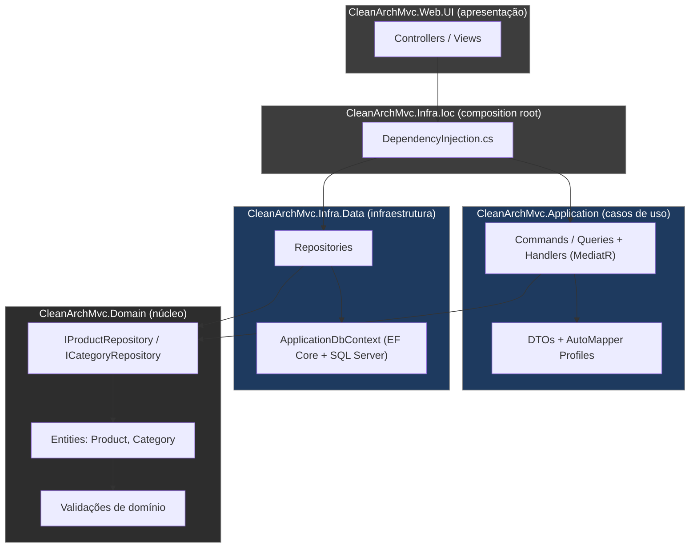

<div align="center">

# CleanArch MVC

**Estudo de caso de Clean Architecture em .NET 5** aplicado a um domínio de e-commerce (Produtos e Categorias), usando CQRS, Repository Pattern e Domain-Driven Design.


</div>

---

## Sumário

- [Por que este projeto existe](#por-que-este-projeto-existe)
- [Arquitetura](#arquitetura)
- [Stack técnica](#stack-técnica)
- [Quickstart](#quickstart)
- [Estrutura do repositório](#estrutura-do-repositório)
- [Decisões de design](#decisões-de-design)
- [Rotas disponíveis](#rotas-disponíveis)
- [Testes](#testes)
- [Estado atual e limitações conhecidas](#estado-atual-e-limitações-conhecidas)
- [Roadmap](#roadmap)

---

## Por que este projeto existe

A maioria dos projetos didáticos de CRUD resolve persistência e para por aí. Este repositório existe para responder uma pergunta diferente: **como estruturar um domínio para que ele não dependa de framework, banco de dados ou UI** — e ainda assim seja simples de testar e evoluir.

Para isso, o projeto isola:
- **regras de negócio** (ex.: um produto não pode ter preço negativo, ou nome com menos de 3 caracteres) dentro das próprias entidades, sem depender de EF Core, MVC ou qualquer biblioteca externa;
- **casos de uso** (criar/atualizar/remover produto) em comandos e queries explícitos via CQRS, em vez de "services gordos" que fazem tudo;
- **detalhes de infraestrutura** (SQL Server, EF Core) atrás de interfaces, para que trocar o banco não exija tocar em regra de negócio.

## Arquitetura



**Regra de dependência:** as setas de importação sempre apontam para o `Domain`. Nenhuma classe do Domínio conhece EF Core, MediatR ou ASP.NET Core — é possível testar todas as regras de negócio sem subir banco de dados ou servidor web (ver [`CleanArchMvc.Domain.Tests`](./CleanArchMvc.Domain.Tests)).

| Camada | Responsabilidade | Depende de |
|---|---|---|
| `Domain` | Entidades, invariantes de negócio, contratos (interfaces) | nada |
| `Application` | Casos de uso (Commands/Queries + Handlers), DTOs, mapeamento | `Domain` |
| `Infra.Data` | EF Core, `DbContext`, Migrations, implementação dos repositórios | `Domain` |
| `Infra.Ioc` | Composition root: registra tudo no container de DI | `Application`, `Infra.Data`, `Domain` |
| `Web.UI` | Controllers, Views, pipeline HTTP | `Infra.Ioc` |

## Stack técnica

| Categoria | Tecnologia | Versão |
|---|---|---|
| Runtime | .NET SDK | **5.0** |
| Web framework | ASP.NET Core MVC | 5.0 |
| ORM | Entity Framework Core (+ SqlServer, Design, Tools) | 5.0.4 |
| Mediator / CQRS | MediatR + MediatR.Extensions.Microsoft.DependencyInjection | 14.1.0 / 9.0.0 |
| Object mapping | AutoMapper + AutoMapper.Extensions.Microsoft.DependencyInjection | 12.0.1 |
| Testes | xUnit + FluentAssertions + coverlet.collector | 2.4.2 / 8.8.0 / 3.2.0 |
| Banco de dados | SQL Server (Code First) | — |

> **Nota de transparência:** .NET 5 saiu de suporte oficial da Microsoft em maio/2022. Manter o projeto nessa versão é aceitável para fins de estudo, mas o próximo passo natural — já listado no roadmap — é migrar para uma LTS atual (.NET 8 ou 9).

## Quickstart

```bash
# 1. Clonar
git clone https://github.com/CVieiraSantos/CleanArch.git
cd CleanArch

# 2. Restaurar dependências de todos os projetos da solução
dotnet restore CleanArchMvc.sln

# 3. Configurar a connection string em
#    CleanArchMvc.Web.UI/appsettings.json -> ConnectionStrings:DefaultConnection

# 4. Instalar a ferramenta de CLI do EF Core (uma vez só, globalmente)
dotnet tool install --global dotnet-ef

# 5. Criar o banco e aplicar as migrations
dotnet ef database update \
  --project CleanArchMvc.Infra.Data \
  --startup-project CleanArchMvc.Web.UI

# 6. Rodar a aplicação
dotnet run --project CleanArchMvc.Web.UI

# 7. Rodar os testes
dotnet test CleanArchMvc.Domain.Tests
```

A aplicação inicia na rota `Products/Index` (definida como rota padrão em `Startup.cs`).

## Estrutura do repositório

<details>
<summary>Clique para expandir</summary>

```
CleanArch/
├── CleanArchMvc.Domain/            # Entidades + regras de negócio + interfaces
│   ├── Entities/                     Product.cs, Category.cs, Base.cs
│   ├── Interfaces/                   IProductRepository, ICategoryRepository
│   └── Validation/                   DomainExceptionValidation
│
├── CleanArchMvc.Application/        # Casos de uso (CQRS)
│   ├── Products/
│   │   ├── Commands/                 Create, Update, Remove
│   │   ├── Queries/                  GetProducts, GetProductById
│   │   └── Handlers/                 MediatR handlers
│   ├── Services/                     ProductService, CategoryService
│   ├── DTOs/                         ProductDTO, CategoryDTO
│   └── Mappings/                     AutoMapper Profiles
│
├── CleanArchMvc.Infra.Data/         # Persistência
│   ├── Context/                      ApplicationDbContext
│   ├── EntitiesConfiguration/        Fluent API
│   ├── Migrations/
│   └── Repositories/
│
├── CleanArchMvc.Infra.Ioc/          # Composition root
│   └── DependencyInjection.cs
│
├── CleanArchMvc.Web.UI/             # Apresentação (MVC)
│   ├── Controllers/                  ProductsController, CategoriesController
│   ├── Views/
│   └── Program.cs / Startup.cs
│
└── CleanArchMvc.Domain.Tests/       # Testes unitários (xUnit)
```

</details>

## Decisões de design

- **Entidades ricas em vez de anêmicas.** `Product` e `Category` têm setters privados e só mudam de estado através de métodos que validam as regras (`Update`, construtores). Isso impede que qualquer camada externa monte um objeto em estado inválido.
- **CQRS via MediatR, não "só para usar".** Separar `ProductCreateCommand` de `GetProductsQuery` faz sentido aqui porque o pipeline de escrita (validação de domínio) é mais rico que o de leitura (que só projeta DTOs). Para um domínio deste tamanho, é uma escolha didática — em um sistema maior, CQRS costuma vir acompanhado de modelos de leitura/escrita fisicamente separados, o que **não** é o caso aqui (mesmo `DbContext` para os dois lados).
- **Repository Pattern com interface no Domínio.** `IProductRepository` é definido em `Domain` e implementado em `Infra.Data`, seguindo a Regra de Dependência: o núcleo do sistema não conhece EF Core.
- **Composition root único (`Infra.Ioc`).** Toda a configuração de DI fica isolada, evitando que `Startup.cs` vire um acumulado de `services.AddX()` espalhado.

## Rotas disponíveis

| Método | Rota | Controller | Ação |
|---|---|---|---|
| GET | `/` ou `/Products` | `ProductsController` | `Index` — lista produtos |
| GET | `/Categories` | `CategoriesController` | `Index` — lista categorias |

## Testes

```bash
dotnet test CleanArchMvc.Domain.Tests
```

O projeto de testes (`CleanArchMvc.Domain.Tests`) valida as regras de negócio das entidades `Product` e `Category` de forma isolada — sem banco de dados, sem HTTP, sem mocks de infraestrutura — usando **xUnit** para execução e **FluentAssertions** para asserts mais legíveis.

## Estado atual e limitações conhecidas

Para ser transparente sobre o estágio do projeto (importante para quem for avaliar o código):

- Os **Commands** de criar/atualizar/remover produto já existem na camada `Application` (com handlers via MediatR), mas os **Controllers da Web.UI hoje só expõem `Index` (GET)** — ou seja, o CRUD completo ainda não está fiado de ponta a ponta na interface web.
- Não há testes de integração (API/Controllers), apenas testes unitários de domínio.
- Não há pipeline de CI configurado neste repositório.
- Não há arquivo de licença (`LICENSE`) na raiz do projeto.

## Roadmap

- [ ] Completar as ações de Create/Edit/Delete nos Controllers, consumindo os Commands já existentes
- [ ] Migrar de .NET 5 para .NET 8/9 (LTS)
- [ ] Adicionar pipeline de CI (build + testes) via GitHub Actions
- [ ] Adicionar `LICENSE` e `CONTRIBUTING.md`
- [ ] Testes de integração para os Controllers
- [ ] Expor uma Web API (além do MVC) documentada com Swagger/OpenAPI
- [ ] Validação de entrada com FluentValidation nos Commands

---

<div align="center">

Desenvolvido por [**CVieiraSantos**](https://github.com/CVieiraSantos)

</div>
